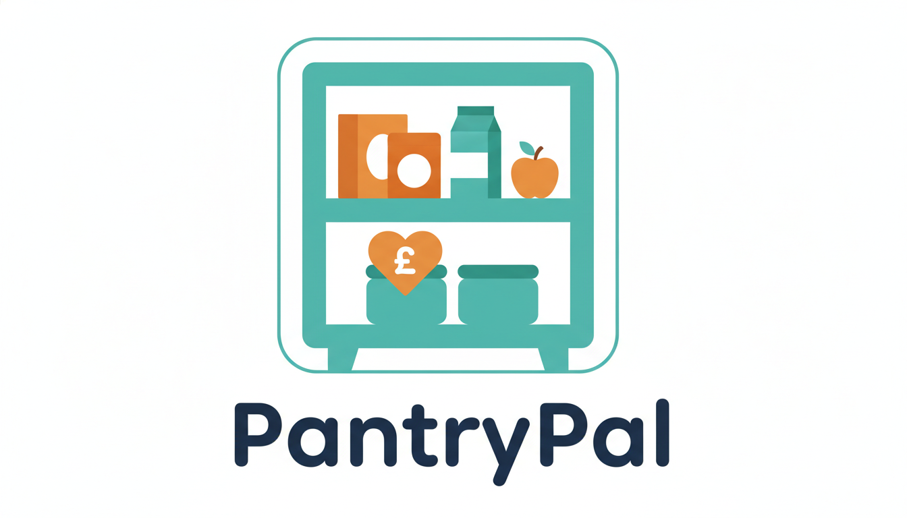
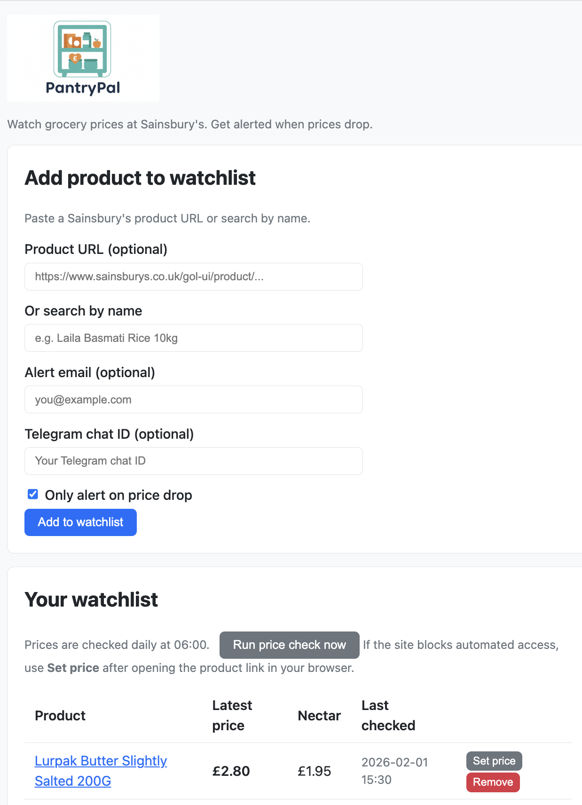

# PantryPal

**Price watch for groceries — get alerted when prices drop (e.g. rollbacks) at Sainsbury's and, later, other retailers.**



---

## Goals

- **POC:** Watch 1–2 products at **Sainsbury's**; daily check; alert on price change (especially rollbacks).
- **Web UI:** Simple form to add products, view watchlist and alerts.
- **Extensible:** Same pattern for Tesco, Aldi, etc. — long-term vision similar to [petrolprices.com](https://www.petrolprices.com/) but for groceries (location optional later).
- **Deploy:** Run on Azure (e.g. AKS) and/or laptop (e.g. Rancher Desktop); vendor-agnostic (Python, containerised, K8s-friendly).

## What PantryPal Does (POC)

1. User adds a product (e.g. **"Laila Basmati Rice 10kg"** or exact name).
2. System finds it on Sainsbury's (fuzzy match if feasible; otherwise exact).
3. Daily job records price (and Nectar price if available).
4. On price change (e.g. drop from £19 → £12), user gets an alert (Telegram and/or email).
5. Frontend shows watchlist and latest prices; optional simple “best deal” view.

## Tech Summary (POC)

| Area        | Choice / direction |
|------------|---------------------|
| Backend    | Python (FastAPI)    |
| Storage    | SQLite (POC); schema ready for Postgres later |
| Scheduler  | Daily run (APScheduler or cron in container) |
| Alerts     | Pluggable: Telegram (you have MCP/bot), email |
| Frontend   | Simple form + watchlist + alerts (e.g. Jinja + HTMX or small React) |
| Vendors    | Abstract interface; Sainsbury's first |
| Deployment | Docker; K8s manifests for Rancher Desktop / AKS |

## Repo Layout

```
PantryPal/
├── README.md
├── docs/
│   └── DESIGN.md          # Detailed design (vendors, data model, alerts)
├── backend/               # Python API + jobs
│   ├── app/
│   │   ├── vendors/       # base + Sainsbury's; Tesco, Aldi later
│   │   ├── alerts/        # Telegram, email
│   │   ├── jobs/          # Daily price check
│   │   ├── api/           # REST for frontend
│   │   └── main.py
│   ├── requirements.txt
│   └── Dockerfile
├── frontend/              # Simple UI for form + watchlist (see frontend/README.md)
├── deploy/                # K8s / Docker Compose (Azure + laptop)
└── docker-compose.yml     # Local run
```

## Running locally



**Option A — Python (from repo root)**

```bash
cd PantryPal/backend
python -m venv .venv
source .venv/bin/activate   # or .venv\Scripts\activate on Windows
pip install -r requirements.txt
playwright install chromium
uvicorn app.main:app --reload --host 0.0.0.0 --port 8000
```

Then open **http://localhost:8000** (use `http://` not `https://` — Chrome may auto-add https, which causes "Invalid HTTP request" on a plain HTTP server).

**Option B — Docker**

```bash
cd PantryPal
docker compose up --build
```

Open **http://localhost:8000** (use `http://` not `https://`).

- Set `TELEGRAM_BOT_TOKEN` and optionally `SMTP_*` env vars for alerts. DB path: `PANTRY_DB_PATH` (default `pantry.db`).

## Testing the POC

1. **Add a product**
   - Open http://localhost:8000
   - Either paste a Sainsbury's product URL (e.g. `https://www.sainsburys.co.uk/gol-ui/product/laila-basmati-rice-10kg`) **or** type a search term (e.g. `Laila Basmati Rice 10kg`) and leave URL blank.
   - Click **Add to watchlist**. The first add can take 10–20 seconds (Playwright loads the page). If you see "No products found" or a timeout, try the direct URL.
   - The product appears in **Your watchlist**. If **Latest price** and **Last checked** show — (Sainsbury's often blocks automated access), use **Set price** below.

2. **Set price manually (when scraping is blocked)**
   - Open the product link from the watchlist in your browser and note the price (and Nectar price if shown). Back on PantryPal, click **Set price** for that row, enter the price (e.g. `12` or `12.50`), then optionally the Nectar price or Cancel to use the same. **Latest price**, **Nectar**, and **Last checked** will update.

3. **Run price check now**
   - With at least one product on the watchlist, click **Run price check now**. The job tries to fetch current prices; if the site allows it, prices and **Last checked** update. If not, use **Set price** to record what you see in your browser.

4. **Test alerts (optional)**
   - Add your **Telegram chat ID** (and/or **Alert email**) when adding a product, or add a product first then edit isn’t in the POC — add a new row with the same product and your Telegram/email.
   - Set `TELEGRAM_BOT_TOKEN` in `.env` (get the token from [@BotFather](https://t.me/BotFather)).
   - Run the price check twice: first run records the current price; if you can’t change Sainsbury’s price, you won’t see an alert. To simulate a drop you’d need two different recorded prices (e.g. run once, manually change something in the DB for testing, run again — or wait for a real price change).

5. **Remove from watchlist**
   - Click **Remove** on a row to delete it from the watchlist.

6. **API**
   - `GET /health` — health check  
   - `GET /api/watchlist` — list watchlist (JSON)  
   - `POST /api/watchlist/add` — add product (JSON body: `url` or `search_query`, optional `alert_email`, `alert_telegram_chat_id`)  
   - `DELETE /api/watchlist/{id}` — remove from watchlist  
   - `POST /api/jobs/run-now` — run the daily price check job now (for testing)  
   - `POST /api/products/{product_id}/price` — record price manually (body: `{"price": 12, "nectar_price": 11}`)

## Design Details

See **[docs/DESIGN.md](docs/DESIGN.md)** for:

- Vendor abstraction (add Tesco/Aldi later)
- Data model (products, watchlist, price history)
- Alert channels (Telegram, email)
- Optional: secondary “one result from Google/Bing” for comparison
- Future: location for “cheapest near me” (petrolprices-style)

---

*POC scope: Sainsbury's only, 1–2 products, daily check, simple frontend, extensible for more vendors and features.*
